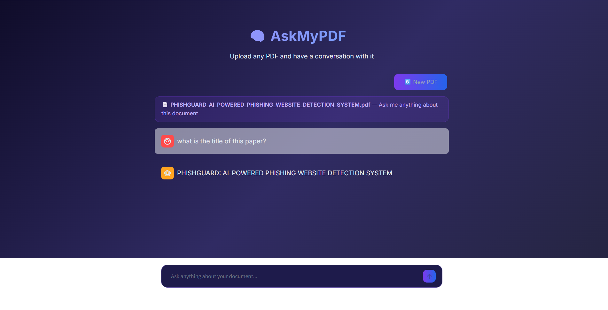

# 🧠 AskMyPDF

A RAG-based Document Q&A system that lets you chat with any PDF using AI.

## Demo Screenshot

## Features
- 📄 Upload any PDF and ask questions about it
- 🔍 Semantic search using vector embeddings
- 🤖 Powered by Groq LLaMA 3.3 70B
- 📎 Source citations with page numbers
- 💬 Chat interface built with Streamlit

## Tech Stack
- LangChain + ChromaDB (RAG pipeline)
- Sentence Transformers (embeddings)
- Groq API — LLaMA 3.3 70B (LLM)
- Streamlit (UI)

## Setup
1. Clone the repo
2. Install dependencies: `pip install -r requirements.txt`
3. Add your Groq API key to `.env`:
GROQ_API_KEY=your_key_here
4. Run: `streamlit run app.py`

## Demo
Upload a research paper, report, or any PDF and start asking questions!